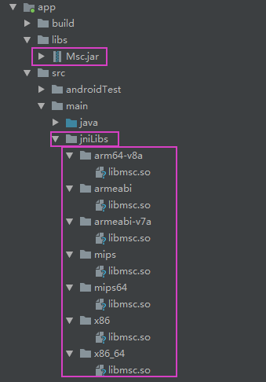

# 华为全面屏适配

https://developer.huawei.com/consumer/cn/devservice/doc/50111

# 高德地图集成SDK

[高德地图 的Android Studio配置工程 ](https://lbs.amap.com/api/android-navi-sdk/guide/create-project/android-studio/)

``` 
buildscript {
    repositories {
        mavenCentral() //
        google()
        jcenter()
    }
}

allprojects {
    repositories {
        mavenCentral() //
        google()
        jcenter()
    }
}
```

``` 
android {
    defaultConfig {
        //设置支持的SO库架构（开发者可以根据需要，选择一个或多个平台的so）
        ndk {
            abiFilters "armeabi", "armeabi-v7a", "arm64-v8a", "x86", "arm64-v8a", "x86_64"
        }
    }
}

dependencies {
    //map3d和map2d只能存在一个，且导航只能使用map3d
    //navi导航SDK 5.0.0以后版本包含了3D地图SDK，所以请不要同时引入 map3d 和 navi SDK。
    //3D地图
    //implementation 'com.amap.api:3dmap:latest.integration'
    //2D地图
    //implementation 'com.amap.api:map2d:latest.integration'
    //导航
    implementation 'com.amap.api:navi-3dmap:latest.integration'
    //搜索
    implementation 'com.amap.api:search:latest.integration'
    //定位
    implementation 'com.amap.api:location:latest.integration'    
}
```


# 科大讯飞集成SDK

[科大讯飞 的SDK下载](https://console.xfyun.cn/app/myapp?currPage=1&keyword=)




# 测试

test2 ： 综合使用搜索和导航实现导航到周边餐馆功能示例

https://github.com/amap-demo/android-navi-quick-start

